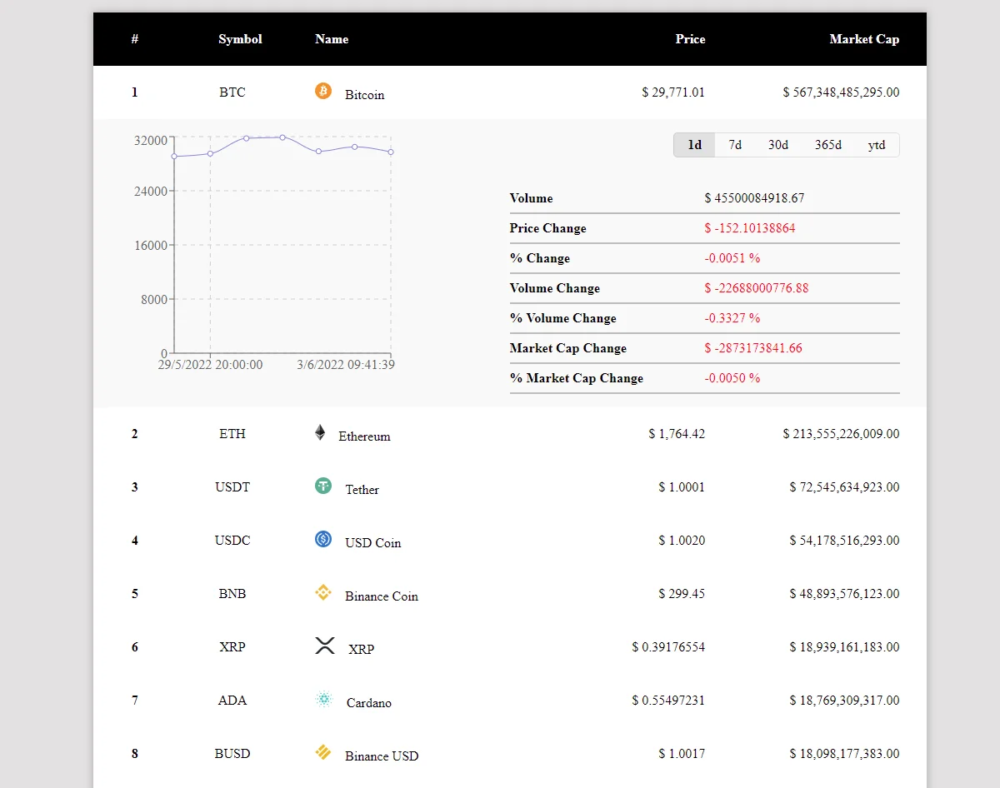

# `CryptoApiMarket`

Ejercicio de consumo de Api de Criptomonedas

Diseño web propio, se hizo simple para facilitar el desarrollo.

Hooks usados, useState y useEffect, useContext y useReducer, estos dos últimos como el fin de practicar.

**APIs :** 
* https://api.nomics.com
* https://api.coingecko.com

## Click para ver [Demo](https://marco90v.github.io/cryptoApiMarket/)

### `Desarrollo: `
* React
* recharts
* Fetch
* HTML
* CSS
* Grid
* Flexbox
  
### `Vistas:`
* Home - Lista de las primeras 100 Criptomonedas según su rango o más importantes del mercado.

### `Componentes:`
* Row - detalles simple de la criptomoneda
* Details - detalles completos de la criptomoneda

### `Capturas:`

### `yarn start`

Runs the app in the development mode.\
Open [http://localhost:3000](http://localhost:3000) to view it in your browser.

The page will reload when you make changes.\
You may also see any lint errors in the console.

### `yarn build`

Builds the app for production to the `build` folder.\
It correctly bundles React in production mode and optimizes the build for the best performance.

The build is minified and the filenames include the hashes.\
Your app is ready to be deployed!

See the section about [deployment](https://facebook.github.io/create-react-app/docs/deployment) for more information.

